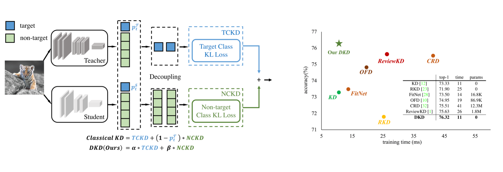
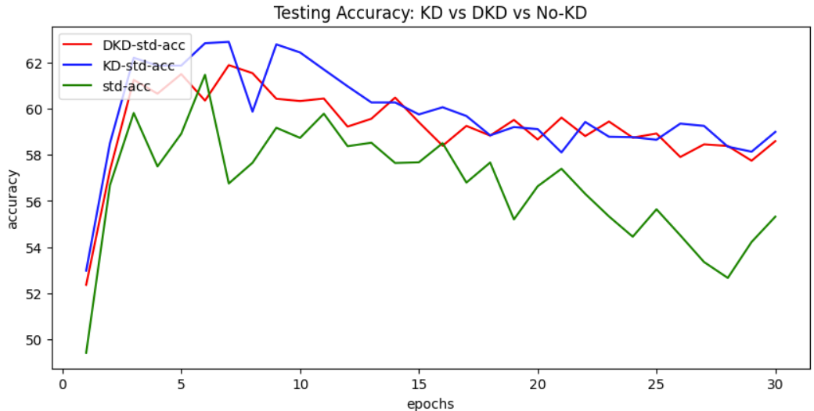

# Decoupled Knowledge Distillation(DKD) for baby models 

This repo is based on the CVPR-2022 paper: [Decoupled Knowledge Distillation](https://arxiv.org/abs/2203.08679).

### Framework & Performance
<br>
<div style="text-align:left"></div>
<br>
### Benchmark Results of DKD-paper on CIFAR-100

| Teacher <br> Student |ResNet56 <br> ResNet20|ResNet110 <br> ResNet32| ResNet32x4 <br> ResNet8x4| WRN-40-2 <br> WRN-16-2| WRN-40-2 <br> WRN-40-1 | VGG13 <br> VGG8|
|:---------------:|:-----------------:|:-----------------:|:-----------------:|:------------------:|:------------------:|:--------------------:|
| KD | 70.66 | 73.08 | 73.33 | 74.92 | 73.54 | 72.98 |
| **DKD** | **71.97** | **74.11** | **76.32** | **76.23** | **74.81** | **74.68** |


| Teacher <br> Student |ResNet32x4 <br> ShuffleNet-V1|WRN-40-2 <br> ShuffleNet-V1| VGG13 <br> MobileNet-V2| ResNet50 <br> MobileNet-V2| ResNet32x4 <br> MobileNet-V2|
|:---------------:|:-----------------:|:-----------------:|:-----------------:|:------------------:|:------------------:|
| KD | 74.07 | 74.83 | 67.37 | 67.35 | 74.45 |
| **DKD** | **76.45** | **76.70** | **69.71** | **70.35** | **77.07** |


### Environment

- Python 3.8.10
- PyTorch 2.0.0
- CUDA 11.7

### Getting started

1. Motivation

- Main motivation for this experiment is to measure decoupled knowledge distillation performance on very simple lightweight models and compare it with classical knowledge distillation. The paper did not explore performance of very simple models with less than 10 layers, in comparison to the 
classical paper: [Distilling the Knowledge in a Neural Network](https://arxiv.org/abs/1503.02531)

- For the experiment, I chose the teacher model as a 5-layer architecture (2 convolution + 3 fully connected layer):
    - For Regularization:
        - I added a dropout of p=0.15 before flattening the intermediate layer
        - I added batch normalization after each convolution and pooling operation
    - The architecture is as follows:
        - conv2d->maxpool->batchnorm->conv2d->maxpool->batchnorm->flatten->dropout->fc+relu->fc+relu->fc
- I maintained the student model to be slightly smaller architecture (2 convolution + 2 fully connected layer):
    - The architecture is as follows:
        - conv2d->maxpool->conv2d->maxpool->flatten->fc + relu->fc


2. Evaluation

- I evaluate the performance of my model using CIFAR-10 dataset, and measure the mean validation accuracy.
- I perform a comparison among student model with decoupled knowledge distillation, basic knowledge distillation, and no distillation.
- Some of the results can be viewed in [checkpoints](checkpoints).

### RESULTS

- For decoupled knowledge distillation and also knowledge distillation, we use the hyperparameters alpha(a), beta(b), and temperature(T)
- For DKD, keeping T > 1.0 (e.g T = 2.0), makes the loss: NAN, and drops accuracy to 1.0%. I tried a range of values of alpha and beta
for DKD, and found the best accuracy to be 59.27%.
- Also, making the DKD loss rely entirely of TCKD (target class knowledge distillation) drops accuracy. There has been no prior explanation on why such values of hyperparameters gives loss: NAN and no accuracy change results. Based on the DKD paper, the beta values show performance increase when beta is 2.0, 4.0, 8.0, increased in that order, but the results were derived from more complex teacher student architectures.
- Also, experimenting with a = 0.5 and a > 1.0  showed worse performance for the student model.
- In the experiment, 30 epochs were used because other-wise the models overfit, and validation accuracy starts decreasing. Based on experimentation trials, a batch size of 64 was used as it best suited the training.

| DKD Student| DKD Student accuracy| KD Student| KD Student accuracy| Student(No-KD)| Student accuracy|
|:---------------:|:---------------:|:---------------:|:---------------:|:---------------:|:---------------:|
| DKD(T=1.0, a=1.0, b=2.0) | 56.28 | KD(T=5.0, a=0.5) | 57.92 | No-KD | 56.49 |
| DKD(T=1.0, a=1.0, b=1.5) | 53.66 | KD(T=5.0, a=0.5) | 57.92 | No-KD | 56.49 |
| **DKD(T=1.0, a=1.0, b=2.5)** | **36.71** | KD(T=1.0, a=0.5) | 59.87 | No-KD | 56.74 |
| DKD(T=1.0, a=0.7, b=1.5) | 52.84 | KD(T=1.0, a=0.5) | 59.87 | No-KD | 56.74 |
| DKD(T=1.0, a=0.7, b=1.0) | 56.07 | KD(T=1.0, a=0.5) | 59.87 | No-KD | 56.74 |
| DKD(T=1.0, a=0.7, b=0.75) | 56.84 | KD(T=1.0, a=0.5) | 59.87 | No-KD | 56.74 |
| DKD(T=1.0, a=0.7, b=0.50) | 58.15 | KD(T=1.0, a=0.5) | 59.87 | No-KD | 56.74 |
| **DKD(T=1.0, a=0.7, b=0.25)** | **59.27** | KD(T=1.0, a=0.5) | 59.87 | No-KD | 56.74 |

<br>
<div style="text-align:left"></div>
<br>
- My results show that IT IS not always the case that decoupled knowledge distillation outperforms knowledgde distillation. One of the reasons could lie in improper fine-tuning of hyperparameters. Also, it difficult to determine the weights/coefficients of the TCKD and NCKD loss, as we do not have much study into the importance of each loss category. Also, the 'very' simplicity of the model architectures could hamper the performance of DKD.
<br>
<br>
- For curiosity, I also tested one of the benchmarks using 240 epochs, batch size 64, on ResNet-50(teacher) and MobileNetV2(student).
- Here, I used CIFAR-100 dataset. The procedures were closely followed as in the paper, and gave positive results.

| Teacher <br> Student | ResNet50 <br> MobileNet-V2|
|:---------------:|:-----------------:|
| No-KD | 52.81% |
| KD | 56.41 |
| **DKD** | **57.89** |

<br>
<br>

# Citation

```BibTeX
@article{zhao2022dkd,
  title={Decoupled Knowledge Distillation},
  author={Zhao, Borui and Cui, Quan and Song, Renjie and Qiu, Yiyu and Liang, Jiajun},
  journal={arXiv preprint arXiv:2203.08679},
  year={2022}
}
```

# License
This project is under the MIT license. See [LICENSE](LICENSE) for details.